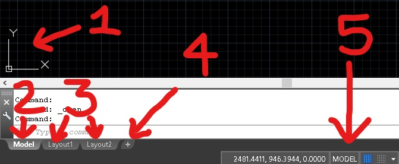
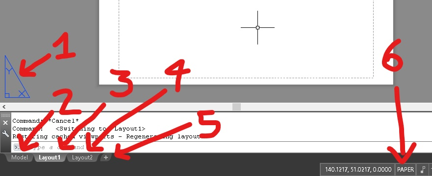

# Guia de Trabalho no Paper Space(Layout) - Autocad.

O **Paper Space** é a maneira mais organizada e clara de se preparar uma planta para a plotagem. O desenho dos projetos é sempre feito no **Model Space** mas, nesta forma de trabalhar, o desenho do formato, do carimbo e, em alguns casos, outras informações de prancha, são desenhados no **Paper Space**.

## Alternando Entre o Model Space e o Paper Space.

A figura abaixo mostra um trecho da interface do Autocad no **Model Space**. O ícone do **UCS**(1)(*User Coordinates System*) indica os eixos x e y do espaço de desenho. As Abas abaixo da linha de comando permitem mudar o espaço de trabalho entre o **Model Space**(2) e o **Paper Space**(3). Para cada Arquivo .DWG existe apenas um **Model Space** mas podem existir diversos **Layouts**. Os **Layouts** são páginas do **Paper Space** que podem ser configuradas para plantas diferentes de um mesmo projeto. Os termos **Paper Space** e **Layout** são comumente usados para se referir ao mesmo conjunto de ferramenta.

É possível mudar do **Model Space** para o **Paper Space** de algumas maneiras:

* Clicando em uma das abas **Layout**(3).
* Clicando no botão **+**(4), para criar uma nova aba de **Layout**.
* Com um duplo clique no botão **Model**(5).

O cliquie em uma das abas **Layout** leva ao **Paper Space** desenhado e configurado na aba clicada. O duplo clique no botão **Model**(5) leva ao **Layout** mais recentemente acessado. O botão **+** cria uma nova aba **Layout**.

A figura abaixo mostra um trecho da interface do Autocad no **Paper Space**. O ícone do **UCS**(1) no **PaperSpace** assemelha-se a um esquadro. Juntamente com o botão **PAPER**(6), o ícone do **UCS** é um dos indicadores de que estamos trabalhando no **Paper Space**. O **Layot** que está sendo editado aparece com o nome realçado na aba(2) e os demais com o nome em cinza(4). Também é possível adicionar um novo **Layout** no botão **+**(5).

É possível mudar do **Paper Space** para o **Model Space**:

* Clicando na aba **Model**(2).
* Digitando o comando **Model** na linha de comandos.

## Desenhando no Paper Space(Layout).

No **Paper Space** as operações de desenho são executadas da mesma forma que no **Model Space**. Os comandos de desenho, edição e ajuste de camadas são os mesmos.

Para desenhar as margens do formato A4:

1. Digite o comando **rectangle(rec)** na linha de comando, ou chame o comando pelo ícone.
1. Clique em um ponto qualquer no **Paper Space**.
1. Digite na linha de comando, as medidas da margem externa **em milímetros**: **@210,297**.
1. Use o comando **offset(o)** com distância de 7mm para desenhar a margem interna.
1. redimensione a margem esquerda para 25mm usando o comando **stretch(s)** ou os **grips**.
1. coloque as margens interna e externa em layers próprios, com cores correspondentes á espessura de linha de cada margem.

## Trabalhando com Viewports.

Os elementos desenhados no **Model Space** são transpostos para o **Layout** através das **Viewports**. O comando **mview(mv)** é responsável pela criação das **Viewports**.

## Configurando a Plotagem no Paper Space(Layout).

As configurações de plotagem no **Paper Space** são basicamente as mesmas do [**Model Space**](.\plot\plotModel.md). Na configuração proposta por este guia, apenas a escala de plotagem, quadro **Plot scale**, deve ser ajutada para **1 mm** x **1 unit**.

## Exibindo as configurações do **CTB** no Paper Space(Layout).

## Ativando a Exibição de Espessura de Linha.
