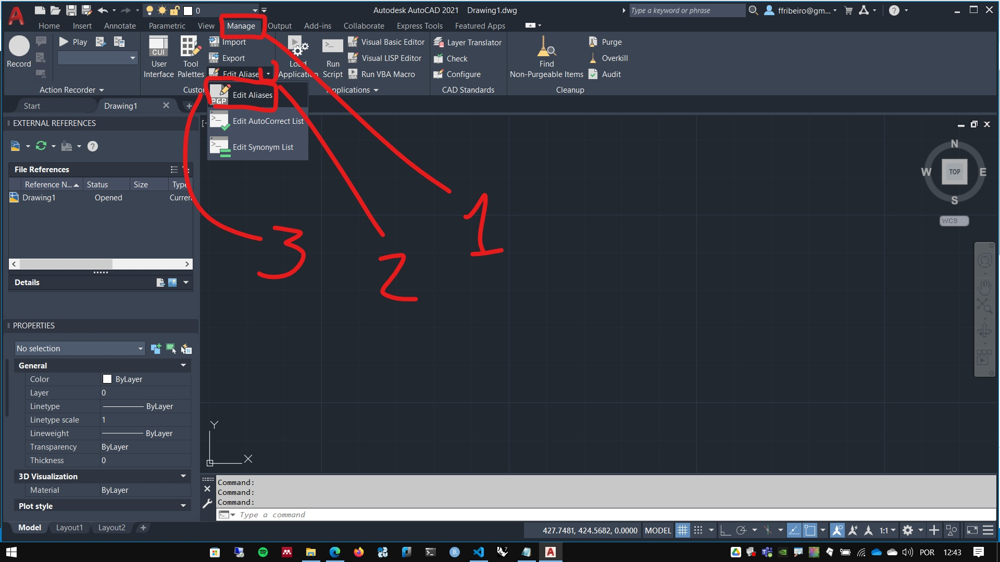

# Editando atalho no Autocad


## Editando atalhos

1. Procure e abra o arquivo Acad.pgp

    * O arquivo, por padrão fica no caminho: ```C:\Users\<user_name>\AppData\Roaming\Autodesk\AutoCAD 2021\R24.0\enu\Support\```
    * Ou, utilizando o atalho: ```%appdata%\Autodesk\AutoCAD 2021\R24.0\enu\Support\```
    * Para abrir o arquivo diretamente, utilize : ```%appdata%\Autodesk\AutoCAD 2021\R24.0\enu\Support\acad.pgp```
    * Também pode ser aberto através do Autocad, na aba Manage ->  Customization -> edit Aliases.
    <br>
  
    
    <br>

    * Este arquivo armazena todos os atalhos do Autocad. Podemos Adicionar, modificar e Excluir atalhos do Autocad editando este arquivo.
    <br>
2. Role o arquivo até o final e acrescente os atalhos desejados da seguinte forma:
    - Use "," (virgula) após as teclas de atalho e "*" (asterisco) antes do nome do comando
    - *\<teclas_de_atalho\>*, &emsp; &emsp; &emsp; **\<Nome_do_comanto\>*

### Exemplo:

```Lisp

;  -- User Defined Command Aliases --
;  Make any changes or additions to the default AutoCAD command aliases in 
;  this section to ensure successful migration of these settings when you
;  upgrade to the next version of AutoCAD.  If a command alias appears more
;  than once in this file, items in the User Defined Command Alias take
;  precedence over duplicates that appear earlier in the file.
;  **********----------**********  ; No xlate ; DO NOT REMOVE


; -- Point Cloud
PC,      *POINTCLOUD
PCINDEX,      *POINTCLOUDINDEX

; -- Annotative scale
AS,       *OBJECTSCALE
ASA,      *AIOBJECTSCALEADD
ASR,      *AIOBJECTSCALEREMOVE
ASY,      *annoreset

; -- Layer options
ctl,      *copytolayer
LIS,      *layiso
liv,      *layvpi
LUS,      *layuniso
lmg,      *laymrg
lc,       *laymcur
lf,       *layfrz
lk,       *laylck
luk,      *layulk
lp,       *layerp
lof,      *layoff
lwk,      *laywalk
ocl,      *laycur

; -- External references and blocks
xcf,     *xclipframe
xe,      *refedit
xo,      *xopen
IB,      *CLASSICINSERT

; -- paper space
CHS,     *CHSPACE

; -- ohter commandas
OO,      *3DORBIT
qs,      *qselect
RVC,     *REVCLOUD


```