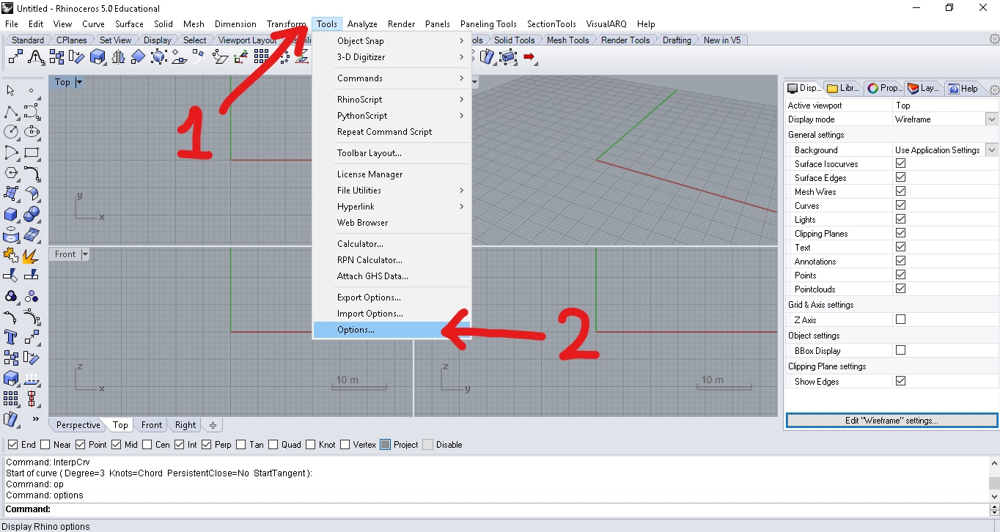
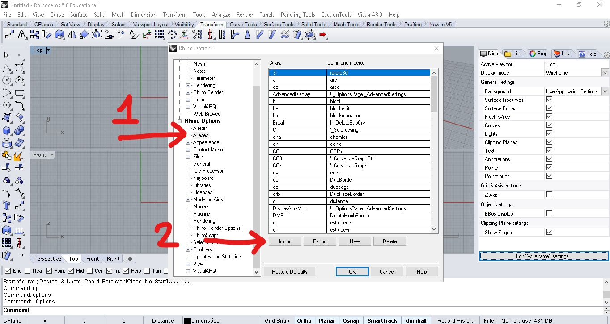
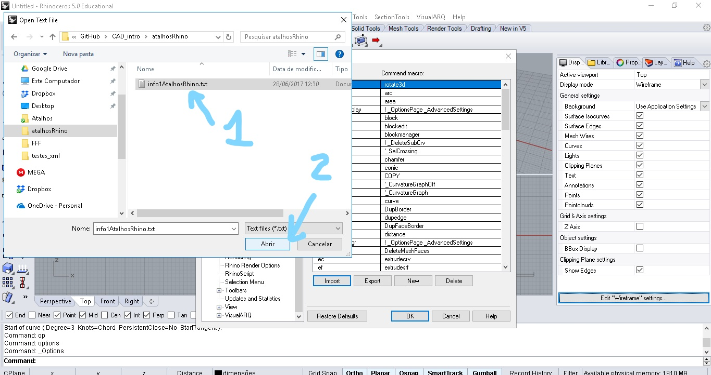

# Configurando Atalhos no Rhinoceros3D

O Rhinoceros3D vem com poucos atalhos configurados previamente. Baixe o arquivo de atalhos no link abaixo:

[Atalhos](info1AtalhosRhino.txt)

Para adicionar atalhos, clique no menu **Tools** e, em seguida, na opção **Options** para abrir a caixa de diálogo de opções.

Na caixa de diálogo de opções, escolha **Aliases** em **Rhino Options** e clique no botão **Import**.

Navegue até o arquivo criado e clique no botão **Abrir**

As equivalências entre os atalhos importados e os atalhos padrão do **Autocad** podem ser conferidos no arquivo abaixo:

[lista de atalhos importados](atalhosCadRhino.pdf)
