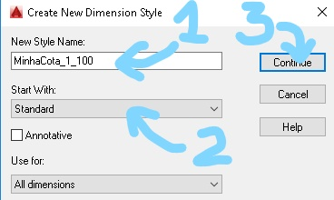
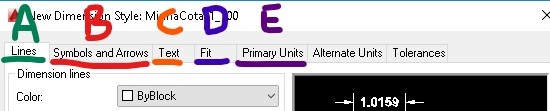
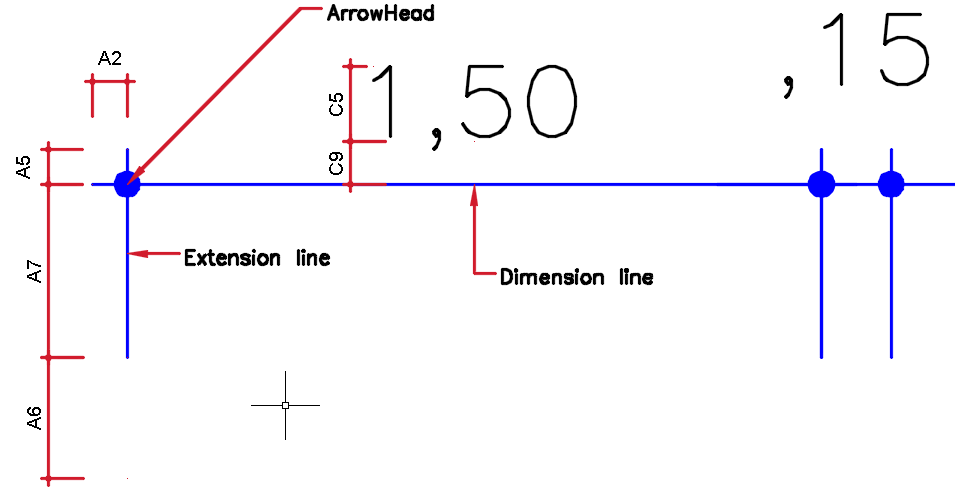
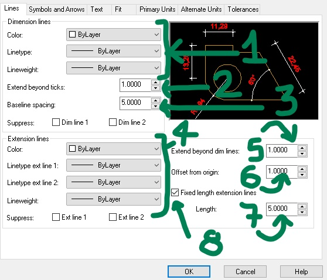
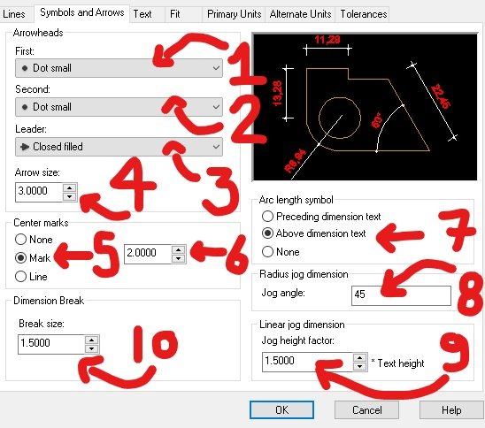
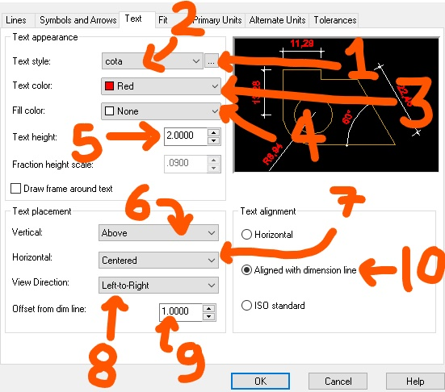
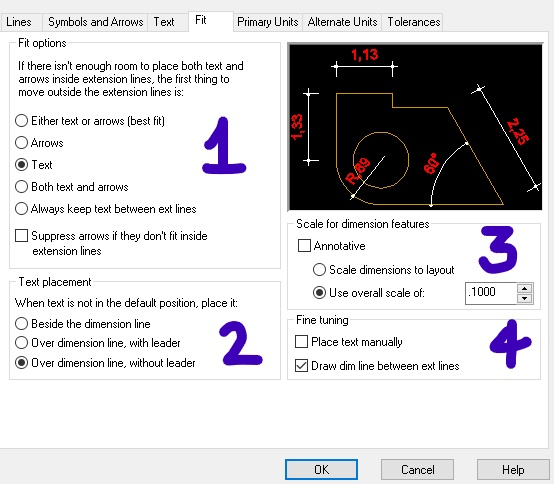
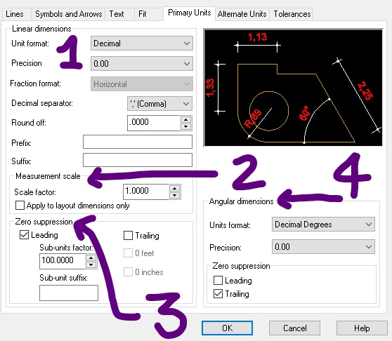

# Guia de Configuração de cotas (dimensões) no Autocad.

Existem várias formas de configurar cotas no Autocad. A estratégia apresentada neste guia se aplica para arquivos com **metros** como unidade de desenho, utilizando escala de plotagem **1000/x**.

## Caixa de diálogo de estilos de dimensões (Dimension Style Manager).

Para abrir a caixa de diálogo de configuração de dimensões **(Dimension Style Manager)** basta digitar o comando **dimstyle(dst)** na linha de comando.

Na caixa de diálogo é possível:
* ver o estilo de dimensão atual em **Current dimension style**(1);
* alterar o estilo de dimensão atual selecionando um estilo em **Styles**(2) e clicando no botão **Set Current**(4);
* visualizar, no quadro **Styles**(2), todos os estilos carregados no arquivo ou apenas os estilos usados (desenhados) no arquivo através do seletor **List**(3);
* criar um novo estilo a partir de um estilo selecionado(2) clicando no botão **New**(5);
* ou modificar um estilo selecionado(2) clicando no botão **Modify**(6)

A imagem no quadro **Preview of** mostra como estão configuradas as cotas e uma descrição pode ser vista logo abaixo no quadro **Description**.

## Criando um novo estilo de dimensões.

Para criar uma nova cota clique no Botão **New**(5) para abrir a caixa de diálogo **Create New Dimension Style**.

* No campo **New Style Name**(1) digite um nome para seu novo estilo de cota (indique a escala que pretende usar).
* No campo **Start With**(2) selecione um dos estilos existentes para basear sua configuração.
* clique no botão **Continue**(3).

##### Obs: Neste guia não será usada a opção *Annotative*.

## Configurando um novo estilo de dimensões.

Nas configurações das cotas, cinco das sete abas devem ser configuradas:
* **Lines**(A);
* **Symbols and Arrows**(B);
* **Text**(C);
* **Fit**(D);
* **Primary Units**(E).

### Lines (A):

No quadro **Dimension Lines** recomenda-se a configuração dos seletores **Color**(A1), **Linetype**(A1) e **Lineweight**(A1) como **Bylayer**. Caso o campo **Extend beyond ticks**(A2) esteja desabilitado, mude os seletores **First**(B1) e **Second**(B2) na caixa **Arrowheads** na aba **Symbols and Arrows**(B) para um **tick** ou **dot**.

A configuração **Baseline spacing**(A3) só funciona com dimensões do tipo **baseline**.

No quadro **Extension lines** recomenda-se a configuração dos seletores **Color**(A4), **Linetype ext line 1**(A4), **Linetype ext line 2**(A4) e **Lineweight**(A4) como **Bylayer**. Os campos **Extend beyond dim lines**(A5) e **Offset from origin**(A6) como 1 mm.

### Symbols and Arrows (B):

No quadro **Arrowheads** os seletores **First**(B1) e **Second**(B2) servem para selecionar os marcadores das cotas. O seletor **Leader** para escolher a seta da dimensão tipo *leader*. O campo **Arrow size** serve para determinar a escala dos símbolos das cotas (**Arrowheads**).É preciso testar os valores para encontrar a escala ideal.

### Text (C):

No quadro **Text appearance** clique no botão (C1) e configure um estilo de texto chamado cota, com a fonte desejada e a altura do texto **(height)** = 0.000. Depois use o seletor(C2) para utilizar o estilo de texto criado. No campo **Text color** escolha uma cor que imprima preto e com uma espessura pequena no seu CTB(0,1 ou 0,2 mm).

### Fit (D):

No quadro **Scale for dimension features**(D3) a opção **Use overall scale of** é responsável pela escala da cota. Para uma cota em **1/100**, o valor do campo deve ser **100/1000 = 0.100**, para **1/50**, **50/1000 = 0.050**...

### Primary Units (E):

#### Finalize a criação do estilo clicando em OK
