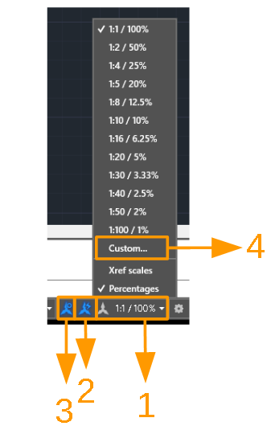

# Guia de Escalas Anotativas no Autocad

___

O recurso de escalas anotativas permite redimensionar elementos de anotação do desenho instantaneamente para a escala de plotagem. Os principais controles das escalas anotativas encontra-se na parte inferior direita da tela.

## Controles das Escalas Anotativas

* O seletor(1) controla a escala anotativa atual.
* O botão(2), quando ativo, adiciona a escala escolhida no seletor à todos os objetos anotativos do desenho.
* O botão(3) controla se elementos que não estão ajustados para a escala anotativa atual são visíveis no desenho.

## Adicionando e Excluindo Escalas

Para adicionar e excluir escalas, clique no seletor(1) e na opção **Custom**(4)

## Download de formatos e blocos

[download de formatos](FORMATOS_A_DINAMICOS_mm.dwg)

[download de blocos anotativos dinâmicos](BLOCOS_ANNOT_D.dwg)
