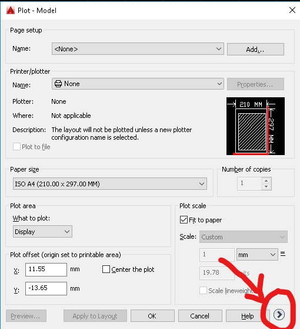
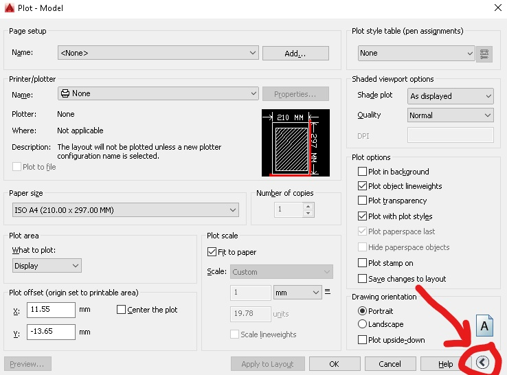

## Guia de plotagem no model space - Autocad.

A caixa de diálogo de plotagem pode ser acionada de várias maneiras:
    * Ícone da impressora,
    * linha de comando PLOT
    * ìcone **A** no lado esquerdo superior da tela > opção print > opção plot;
    * digitando Ctrl + P

A última me parece ser a mais prática e extremamente comum em diversos programas.

Abrindo a caixa de dialogo de plotagem existe um botão em forma de seta, clicando nele, opções especiais de plotagem são exibidas ou ocultadas

#### Caixa de diálogo simples

#### Caixa de diálogo Completa

**Use Sempre a caixa de diálogo completa na plotagem**

