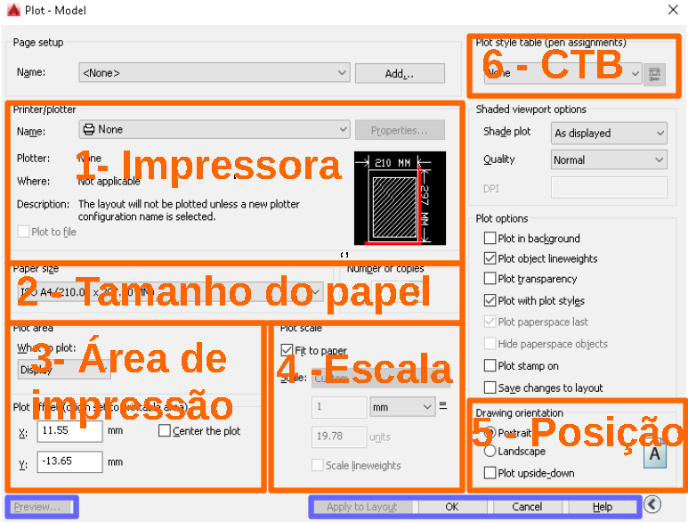
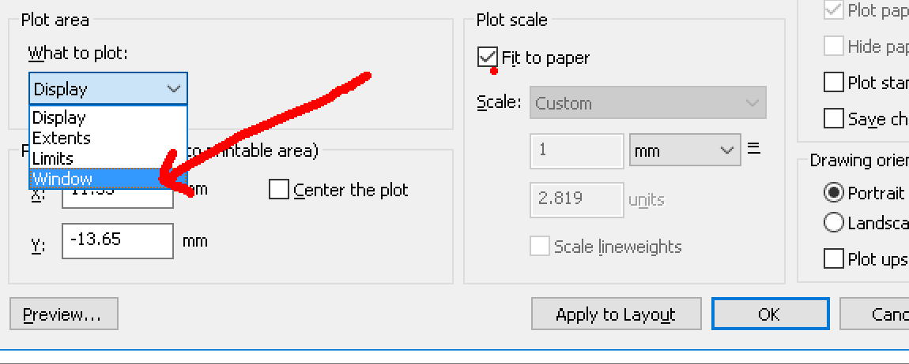
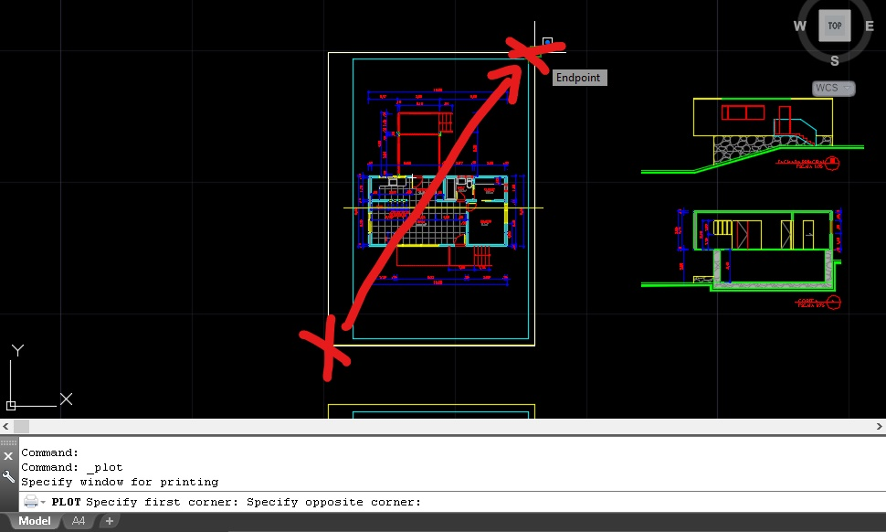
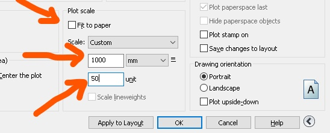

## Guia de plotagem no model space - Autocad.

### Caixa de diálogo de plotagem

A caixa de diálogo de plotagem pode ser acionada de várias maneiras:
    * Ícone da impressora;
    * linha de comando PLOT;
    * ìcone **A** no lado esquerdo superior da tela > opção print > opção plot;
    * digitando Ctrl + P

A última me parece ser a mais prática e extremamente comum em diversos programas.

Abrindo a caixa de dialogo de plotagem existe um botão em forma de seta, clicando nele, opções especiais de plotagem são exibidas ou ocultadas

#### Caixa de diálogo simples

#### Caixa de diálogo Completa

**ATENÇÂO - Use Sempre a caixa de diálogo completa na plotagem**

### Configurando a plotagem

A imagem abaixo mostra os principais quadros da Caixa de diálogo de impressão.

#### Principais quadros da caixa de diálogo

Comece configurando a impressora no quadro **Pritter/Plotter (1- Impressora)**. Para este guia iremos usar a impressora **DWG to PDF.pc3**

Em seguida selecione o tamanho de papel no Quadro **Paper Size(2- Tamanho do Papel)**. Selecione os papeis do tipo **ISO full bleed Ax (... x ... MM)**

#### Tamanho do papel

As medidas **(a x b)** do papel seguem a relação **Largura x Altura**. Mas essa relação pode ser alterada no **quadro Drawing Orientation (5- Posição)**.

No quadro **Plot area (3- Área de impressão /Acima)** deve-se ajustar a região do Model Space a ser impressa. A opção mais comum é **Window**, que leva para o Model para que uma região retangular de impressão possa ser definida.

#### Selecionado opção **window**

#### Selecionado janela de impressão

No quadro **Plot Offset (3- Área de impressão /Abaixo)** é posível mover a origem da área de impressão. A configuração mais comum nesta caixa é marcar a opção **Center the plot**.

#### Configurando a escala

No quadro **Plot scale (4- Escala)** ajuste a escala de plotagem. As opções de unidades para o desenho são apenas milimetros (mm) e Poliegadas (Inches). Para plotar um desenho unde uma unidade de desenho corresponde a um metro, a maneira mais comum de configurar é:
* desmarcar a opção **Fit to paper**,
* ajustar as unidades de dsenenho para 1000 mm;
* ajustar o campo unit para a escala a ser plotada.

#### Configurando escala

### Configurando o CTB

No **quadro Plot Style Table (6- CTB)** é possível selecionar um arquivo de configuração de penas e/ou criar um arquivo novo.
