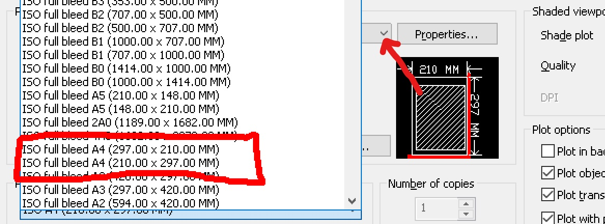
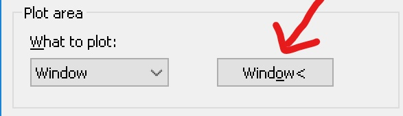
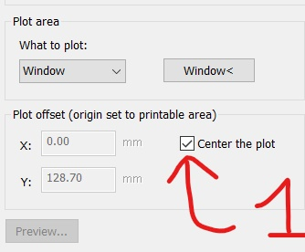
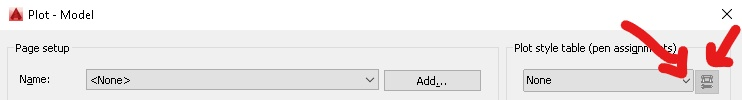
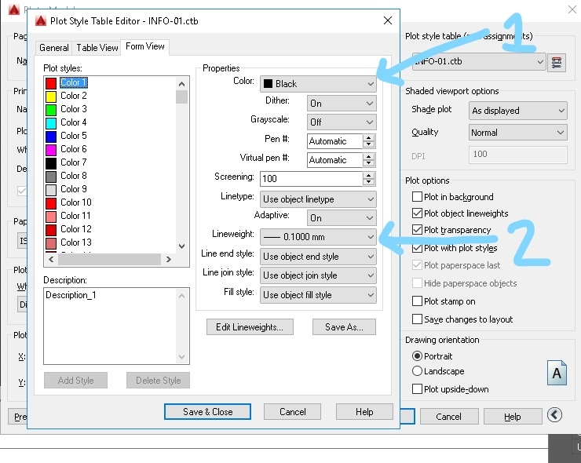
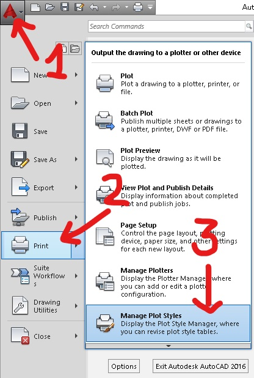

# Guia de plotagem no model space - Autocad.

## Caixa de diálogo de plotagem

A caixa de diálogo de plotagem pode ser acionada de várias maneiras:

* Ícone da impressora;
* linha de comando PLOT;
* ícone **A** no lado esquerdo superior da tela > opção print > opção plot;
* digitando Ctrl + P

A última me parece ser a mais prática e extremamente comum em diversos programas.

Abrindo a caixa de dialogo de plotagem existe um botão em forma de seta, clicando nele, opções especiais de plotagem são exibidas ou ocultadas

<hr>

#### Caixa de diálogo simples


#### Caixa de diálogo Completa


**ATENÇÃO - Use Sempre a caixa de diálogo completa na plotagem**

<hr>

## Configurando a plotagem

A imagem abaixo mostra os principais quadros da Caixa de diálogo de impressão.

<br>

#### Principais quadros da caixa de diálogo


<hr>

Comece configurando a impressora no quadro **Pritter/Plotter (1- Impressora)**. Para este guia iremos usar a impressora **DWG to PDF.pc3**

Em seguida selecione o tamanho de papel no Quadro **Paper Size(2- Tamanho do Papel)**. Selecione os papeis do tipo **ISO full bleed Ax (... x ... MM)**

<hr>

## Tamanho do papel



<hr>

As medidas **(a x b)** do papel seguem a relação **Largura x Altura**. Mas essa relação pode ser alterada no **quadro Drawing Orientation (5- Posição)**.

No quadro **Plot area (3- Área de impressão /Acima)** deve-se ajustar a região do Model Space a ser impressa no seletor **what to plot**. A opção mais comum é **Window**, que leva para o Model para que uma região retangular de impressão possa ser definida.

<hr>

#### Selecionado opção **window**


<hr>

#### Selecionado janela de impressão


No quadro **Plot Offset (3- Área de impressão /Abaixo)** é posível mover a origem da área de impressão. A configuração mais comum nesta caixa é marcar a opção **Center the plot**.

Quando o seletor **what to plot** já está ajustado na opção **Window** a reagião a ser plotada pode ser ajustada clicando no botão **window** ao lado do seletor.




É recomendável centralizar a plotagem, utilizando a caixa de seleção conforme a figura abaixo:



## Configurando a escala

No quadro **Plot scale (4- Escala)** ajuste a escala de plotagem. As opções de unidades para o desenho são apenas milimetros (mm) e Poliegadas (Inches). Para plotar um desenho unde uma unidade de desenho corresponde a um metro, a maneira mais comum de configurar é:
* desmarcar a opção **Fit to paper**,
* ajustar as unidades de dsenenho para 1000 mm;
* ajustar o campo unit para a escala a ser plotada.

#### Configurando escala


<hr>

## Arquivos CTB

O arquivo CTB é a "Rainha de copas" da plotagem. O CTB pode configurar para que elementos de uma determinada cor sejam plotados em outra cor.


### Selecionando e/ou criando arquivos CTB

No **quadro Plot Style Table (6- CTB)** é possível selecionar um arquivo de configuração de espessuras de linha e/ou criar um arquivo novo.

#### OBS: Existem dois formatos de arquivo utilizados para configuração de espessuras de linha, CTB e STB. Esse guia mostra as opções de configuração de plotagem utilizando arquivos CTB.

- Caso seu arquivo esteja configurado para arquivos STB, utilize o  comando abaixo para ajustar seu arquivo para uso dos CTB.
    ```CONVERTPSTYLES```
- Este comando alterna entre a utilização de arquivos STB e CTB na configuração das espessuras de linha nos arquivos.



Selecionando a opção de editar é possível aplicar diversos atributos para uma cor do tipo **index Color**

### Configurando arquivo CTB



Os elementos serão plotados na cor escolhida no seletor **Color** do **quadro Properties**. A espessura de linhas será determinada pelo seletor **Lineweight** do mesmo quadro. Para Utilizar as penas configuradas no quadro de Layers, configure o seletor **Lineweight** para a opção **use object lineweight**.

Os ajustes do arquivo CTB prevalecem sobre as configurações de objeto e de Layer.

Para o Autocad ler o arquivo CTB ele precisa estar no diretório configurado. Para abrir a pasta do CTB:

1. clique no Ícone **A** na parte supeior esqueda da tela;
2. clique na opção seta ao lado da opção **print**
3. clique na opção **Manage Plot Styles**

<hr>

### Abrindo pasta dos CTBs



Copie o arquivo CTB criado e salve na nuvem ou envie por e-mail. Para utilizar o CTB em outro computator, abra a pasta dos CTBs como indicado acima e copie o seu CTB no local.

<hr>
<hr>
