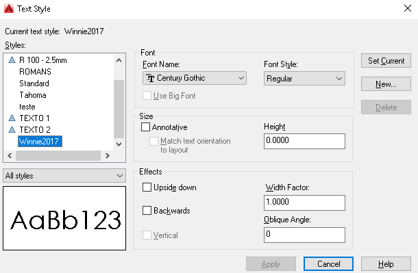
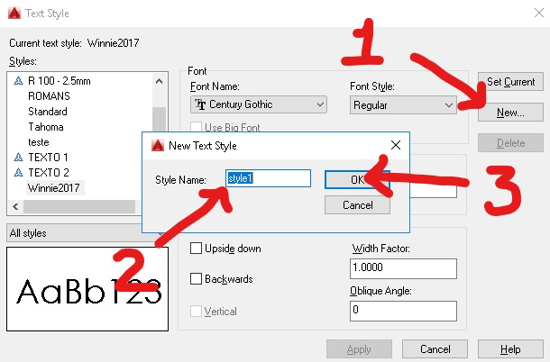
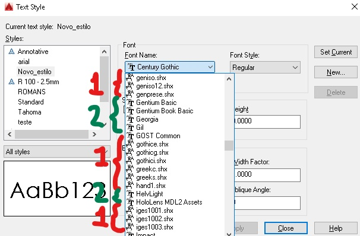
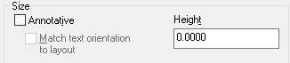

# Guia de Configuração de Textos no Autocad.

Existem três comandos para desenho de textos no Autocad:

1. **text(dt)**;
2. **mtext(t)(mt)**;
3. **attdef(att)**.

O comando **text(dt)** cria textos de uma única linha. O comando **mtext(t)** cria blocos de texto com múltiplas linhas. O comando **attdef(att)** define atributos, muito utilizados em blocos de anotações e carimbo.

## Caixa de Diálogo de Estilos de Texto.

Para abrir a caixa de diálogo de configuração de textos basta digitar o comando **style(st)** na linha de comando.

O quadro **Styles:** Mostra uma lista com os estilos carregados no arquivo. Abaixo da lista, tem um seletor com as opções **All styles**(para todos os estilos carregados no arquivo) e **Styles in use** para mostrar apenas os etilos que foram usados em textos desenhados no arquivo.

## Criando um Estilo Novo de Texto.

Para criar um novo estilo de textos clique no botão **New** na lateral direita da caixa de diálogo. Em seguida, crie um nome para seu estilo de texto e clique no botão **OK**.

Em seguida escolha uma fonte no quadro **Font**, seletor **Font Name**. Existem dois tipos de fonte:

Os tipos **técnico**, identificados com um símbolo de um compasso, e os tipos **True Type**, identificados com duas letras "T" sobrepostas.

As fontes **técnicas** desenham as letras com linhas simples. Para as fontes técnicas, a espessura de pela da fonte tem forte influência sobre a aparência do texto e deve ser mais grossa quando o texto é maior.

As fontes **True Type** são fontes padrão do Windows, sua espessura é aumentada ou diminuída automaticamente de acordo com tamanho de impressão da letra.

## Definindo a Altura do Texto.

A altura do texto é definida no campo **height** do quadro **Size**.

A opção **Annotative** não será usada neste guia.

Quando ajustado para 0.0000 (zero), o tamanho do texto será configurado na linha de comando. A escala de plotagem deve ser levada em conta quando definimos a altura dos textos. Para criar um texto de altura 3,5mm na escala 1/100, deve-se multiplicar o tamanho do texto na unidade desenho pelo denominador da escala **0.0035 x 100**. Neste caso, o valor **3.5** deve ser digitado no campo **Height**.

finalize a criação do estilo de texto clicando no botão **Apply** na parte inferior da caixa de diálogo.

## Selecionado o Estilo de Texto a ser Utilizado.

Como podemos ver no quadro **Styles**, podem existir muitos estilos de texto carregados em um mesmo desenho. Para selecionar o estilo de texto que será usado quando os comando de criação de texto forem acionados:

1. Selecione o estilo de texto que deseja utilizar no quadro **Styles**;
2. clique no botão **Set Current** na direita da caixa de diálogo.

O estilo ajustado como padrão será utilizado quando para criação de textos até que um outro estilo seja definido como atual (botão **Set Current**).

